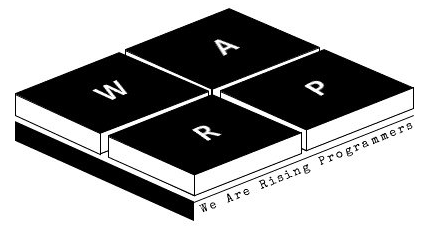

# major-projects-in-university
__한국산업기술대 게임공학과 전공 과목들의 과제 저장소입니다.__ 

  
>### 이 저장소의 목적은 다음과 같습니다.
> 1. 어떤 과목을 수강하기 전, 해당 과목을 통하여 배울 수 있는 것과 만들 수 있는 결과물 들을 미리 확인할 수 있게 하기 위해.
> 2. 텀 프로젝트 기획 단계에서, 다양한 기획적 아이디어와 프로그래밍적인 구현 방안과 코드들을 참고할 수 있도록 하기 위해.
  
  
>### 따라서, 다음과 같은 행위는 절대 허락되지 않습니다.
> 1. 저장소 프로젝트를 다운받아, 수정하여 텀프로젝트 제출.
> 2. 프로젝트 내의 리소스 무단 사용 제한.
> 3. 일부 과목들은 업로드가 일부 제한됩니다.
>* 윈도우 프로그래밍 - 1차 과제, 2차 과제 (코드, 영상, exe, 문서 전부 제한)   
-사유 : 과제 주제 스포 방지, 코드 구현이 점수에 큰 영향을 미침
>* 자료구조 - 오목, 롤딕셔너리 (코드, 문서 제한)   
-사유 : 코드 구현이 점수에 큰 영향을 미침.
>* 컴퓨터 그래픽스 - 1차 과제, 2차 과제 (코드, 영상, exe, 문서 전부 제한)    
-사유 : 과제 주제 스포 방지, 코드 구현이 점수에 큰 영향을 미침
>* STL - 중간과제, 최종과제 (코드, 문서 제한)   
-사유 : 컨테이너 선정, 로직 구현이 점수에 큰 영향을 미침
  
___
  
>### 프로젝트는 다음 형태의 일부로 제공됩니다.
>
> 1. 프로젝트 제공 시,
>* 해당 프로젝트의 깃헙 저장소가 있을 경우, 프로젝트 깃헙 저장소 링크
>* 해당 프로젝트의 깃헙 저장소가 없을 경우, 프로젝트 파일
>
> 2. 동영상 제공 시,
>* 해당 프로젝트 동영상 녹화 및 업로드 후, 해당 영상 링크
>
> 3. exe 제공 시,
>* 해당 exe가 100mb 이하일 경우, 깃헙 업로드
>* 해당 exe가 100mb 이상일 경우, 드라이브 업로드 후, 해당 파일 링크 
>
> 4. 문서 제공 시,
>* 해당 문서 파일
>###### 업로드를 희망할 시, "원성연"으로 카톡부탁드립니다. 
  
___

>### 프로젝트가 제공되는 전공 과목들은 다음과 같습니다.
> 
>> ##### 2학년 1학기
>>* [윈도우프로그래밍(WinAPI)](https://github.com/KPU-WARP/major-projects-in-university/tree/master/2%ED%95%99%EB%85%841%ED%95%99%EA%B8%B0_%EC%9C%88%EB%8F%84%EC%9A%B0%ED%94%84%EB%A1%9C%EA%B7%B8%EB%9E%98%EB%B0%8D(WinAPI))
>>* [자료구조](https://github.com/KPU-WARP/major-projects-in-university/tree/master/2%ED%95%99%EB%85%841%ED%95%99%EA%B8%B0_%EC%9E%90%EB%A3%8C%EA%B5%AC%EC%A1%B0)
>
>> ##### 2학년 2학기
>>* [2D게임프로그래밍(Python - Pico2D)](https://github.com/KPU-WARP/major-projects-in-university/tree/master/2%ED%95%99%EB%85%842%ED%95%99%EA%B8%B0_2D%EA%B2%8C%EC%9E%84%ED%94%84%EB%A1%9C%EA%B7%B8%EB%9E%98%EB%B0%8D(Python))
>>* [컴퓨터그래픽스(OpenGL)](https://github.com/KPU-WARP/major-projects-in-university/tree/master/2%ED%95%99%EB%85%842%ED%95%99%EA%B8%B0_%EC%BB%B4%ED%93%A8%ED%84%B0%EA%B7%B8%EB%9E%98%ED%94%BD%EC%8A%A4(OpenGL))
>
>> ##### 3학년 1학기
>>* [스크립트언어(Python)](https://github.com/KPU-WARP/major-projects-in-university/tree/master/3%ED%95%99%EB%85%841%ED%95%99%EA%B8%B0_%EC%8A%A4%ED%81%AC%EB%A6%BD%ED%8A%B8%EC%96%B8%EC%96%B4(Python))
>>* [STL](https://github.com/KPU-WARP/major-projects-in-university/tree/master/3%ED%95%99%EB%85%841%ED%95%99%EA%B8%B0_STL)
>
>> ##### 3학년 2학기
>>* [네트워크게임프로그래밍](https://github.com/KPU-WARP/major-projects-in-university/tree/master/3%ED%95%99%EB%85%842%ED%95%99%EA%B8%B0_%EB%84%A4%ED%8A%B8%EC%9B%8C%ED%81%AC%EA%B2%8C%EC%9E%84%ED%94%84%EB%A1%9C%EA%B7%B8%EB%9E%98%EB%B0%8D)

___

### 감사합니다. WARP
